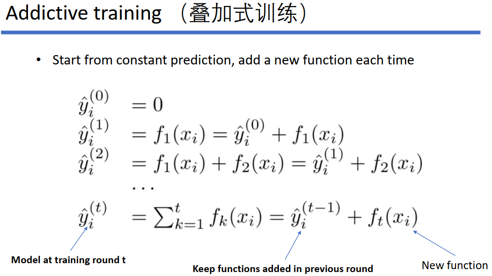

### XGBoost简介

> XGBoost的全称是eXtreme Gradient Boosting,论文：[Xgboost: A scalable tree boosting system](https://dl.acm.org/doi/abs/10.1145/2939672.2939785)

#### 原理推导




#### 优缺点

##### 优点

1. **精度更高：**GBDT 只用到一阶泰勒展开，而 XGBoost 对损失函数进行了二阶泰勒展开。XGBoost 引入二阶导一方面是为了增加精度，另一方面也是为了能够自定义损失函数，二阶泰勒展开可以近似大量损失函数；
2. **灵活性更强：**GBDT 以 CART 作为基分类器，XGBoost 不仅支持 CART 还支持线性分类器，使用线性分类器的 XGBoost 相当于带 L1 和 L2 正则化项的逻辑斯蒂回归（分类问题）或者线性回归（回归问题）。此外，XGBoost 工具支持自定义损失函数，只需函数支持一阶和二阶求导；
3. **正则化：**XGBoost 在目标函数中加入了正则项，用于控制模型的复杂度。正则项里包含了树的叶子节点个数、叶子节点权重的 L2 范式。正则项降低了模型的方差，使学习出来的模型更加简单，有助于防止过拟合，这也是XGBoost优于传统GBDT的一个特性。
4. **Shrinkage（缩减）：**相当于学习速率。XGBoost 在进行完一次迭代后，会将叶子节点的权重乘上该系数，主要是为了削弱每棵树的影响，让后面有更大的学习空间。传统GBDT的实现也有学习速率；
5. **列抽样：**XGBoost 借鉴了随机森林的做法，支持列抽样，不仅能降低过拟合，还能减少计算。这也是XGBoost异于传统GBDT的一个特性；
6. **缺失值处理：**对于特征的值有缺失的样本，XGBoost 采用的稀疏感知算法可以自动学习出它的分裂方向；
7. **XGBoost工具支持并行：**XGBoost的并行是在特征粒度上的。我们知道，决策树的学习最耗时的一个步骤就是对特征的值进行排序（因为要确定最佳分割点），XGBoost在训练之前，预先对数据进行了排序，然后保存为block结构，后面的迭代中重复地使用这个结构，大大减小计算量。

##### 缺点

1. 虽然利用预排序和近似算法可以降低寻找最佳分裂点的计算量，但在节点分裂过程中仍需要遍历数据集；
2. 预排序过程的空间复杂度过高，不仅需要存储特征值，还需要存储特征对应样本的梯度统计值的索引，相当于消耗了两倍的内存。

#### **XGBoost实例**

> XGBoost有两大类接口：XGBoost原生接口 和 scikit-learn接口 ，并且XGBoost能够实现分类和回归两种任务。

1. 基于XGBoost原生接口的分类

```python
from sklearn.datasets import load_iris
import xgboost as xgb
from xgboost import plot_importance
from matplotlib import pyplot as plt
from sklearn.model_selection import train_test_split

# read in the iris data
iris = load_iris()

X = iris.data
y = iris.target

# split train data and test data
X_train, X_test, y_train, y_test = train_test_split(X, y, test_size=0.2, random_state=1234565)

# set XGBoost's parameters
params = {
    'booster': 'gbtree',
    'objective': 'multi:softmax',   # 回归任务设置为：'objective': 'reg:gamma',
    'num_class': 3,      # 回归任务没有这个参数
    'gamma': 0.1,
    'max_depth': 6,
    'lambda': 2,
    'subsample': 0.7,
    'colsample_bytree': 0.7,
    'min_child_weight': 3,
    'silent': 1,
    'eta': 0.1,
    'seed': 1000,
    'nthread': 4,
}

plst = params.items()

dtrain = xgb.DMatrix(X_train, y_train)
num_rounds = 500
model = xgb.train(plst, dtrain, num_rounds)

# 对测试集进行预测
dtest = xgb.DMatrix(X_test)
ans = model.predict(dtest)

# 计算准确率
cnt1 = 0
cnt2 = 0
for i in range(len(y_test)):
    if ans[i] == y_test[i]:
        cnt1 += 1
    else:
        cnt2 += 1

print("Accuracy: %.2f %% " % (100 * cnt1 / (cnt1 + cnt2)))

# 显示重要特征
plot_importance(model)
plt.show()
```

2. 基于Scikit-learn接口的回归

```python
import pandas as pd
from sklearn.model_selection import train_test_split
from sklearn.impute import SimpleImputer
import xgboost as xgb
from sklearn.metrics import mean_absolute_error

# 1.读文件
data = pd.read_csv('./dataset/train.csv')
data.dropna(axis=0, subset=['SalePrice'], inplace=True)

# 2.切分数据输入：特征 输出：预测目标变量
y = data.SalePrice
X = data.drop(['SalePrice'], axis=1).select_dtypes(exclude=['object'])

# 3.切分训练集、测试集,切分比例7.5 : 2.5
train_X, test_X, train_y, test_y = train_test_split(X.values, y.values, test_size=0.25)

# 4.空值处理，默认方法：使用特征列的平均值进行填充
my_imputer = SimpleImputer()
train_X = my_imputer.fit_transform(train_X)
test_X = my_imputer.transform(test_X)

# 5.调用XGBoost模型，使用训练集数据进行训练（拟合）
# Add verbosity=2 to print messages while running boosting
my_model = xgb.XGBRegressor(objective='reg:squarederror', verbosity=2)  # xgb.XGBClassifier() XGBoost分类模型
my_model.fit(train_X, train_y, verbose=False)

# 6.使用模型对测试集数据进行预测
predictions = my_model.predict(test_X)

# 7.对模型的预测结果进行评判（平均绝对误差）
print("Mean Absolute Error : " + str(mean_absolute_error(predictions, test_y)))
```

#### **关于XGBoost若干问题的思考**

+ GBDT是机器学习算法，XGBoost是该算法的工程实现。

+  **XGBoost对缺失值的处理方式：**XGBoost采取的策略是先不处理那些值缺失的样本，采用那些有值的样本搞出分裂点，在遍历每个有值特征的时候，尝试将缺失样本划入左子树和右子树，选择使损失最优的值作为分裂点。

+ **比较LR和GBDT，说说什么情景下GBDT不如LR**：LR是线性模型，可解释性强，很容易并行化，但学习能力有限，需要大量的人工特征工程，GBDT是非线性模型，具有天然的特征组合优势，特征表达能力强，但是树与树之间无法并行训练，而且树模型很容易过拟合；当在高维稀疏特征的场景下，LR的效果一般会比GBDT好。带正则化的线性模型比较不容易对稀疏特征过拟合。

+ **XGBoost如何评价特征的重要性:**

       1. 该特征在所有树中被用作分割样本的特征的总次数。（**weight**）
          2. 该特征在其出现过的所有树中产生的平均增益。（**gain**）
          3. 该特征在其出现过的所有树中的平均覆盖范围（覆盖范围这里指的是一个特征用作分割点后，其影响的样本数量，即有多少样本经过该特征分割到两个子节点。）。（**cover**）

#### XGBooost参数调优的一般步骤

**首先需要初始化一些基本变量**，例如：

+ max_depth = 5
+ min_child_weight = 1
+ gamma = 0
+ subsample, colsample_bytree = 0.8
+ scale_pos_weight = 1

**确定learning rate和estimator的数量**

+ learning rate可以先用0.1，用cv来寻找最优的estimators

**max_depth与min_child_weight**

我们调整这两个参数是因为，这两个参数对输出结果的影响很大。我们首先将这两个参数设置为较大的数，然后通过迭代的方式不断修正，缩小范围。max_depth，每棵子树的最大深度，check from range(3,10,2)。min_child_weight，子节点的权重阈值，check from range(1,6,2)。如果一个结点分裂后，它的所有子节点的权重之和都大于该阈值，该叶子节点才可以划分。

**gamma**

也称作最小划分损失`min_split_loss`，check from 0.1 to 0.5，指的是，对于一个叶子节点，当对它采取划分之后，损失函数的降低值的阈值。如果大于该阈值，则该叶子节点值得继续划分

**降低学习率**

降低学习率的同时增加树的数量，通常最后设置学习率为0.01~0.1

#### XGBoost和LightGBM的区别

+ 树生长策略：XGB采用`level-wise`的分裂策略，LGB采用`leaf-wise`的分裂策略。XGB对每一层所有节点做无差别分裂，但是可能有些节点增益非常小，对结果影响不大，带来不必要的开销。Leaf-wise是在所有叶子节点中选取分裂收益最大的节点进行的，但是很容易出现过拟合问题，所以需要对最大深度做限制 。
+ 分割点查找算法：XGB使用特征预排序算法，LGB使用基于直方图的切分点算法。


