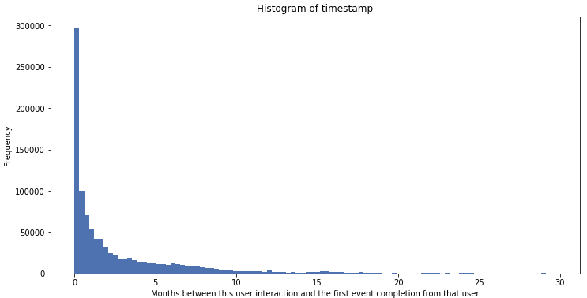
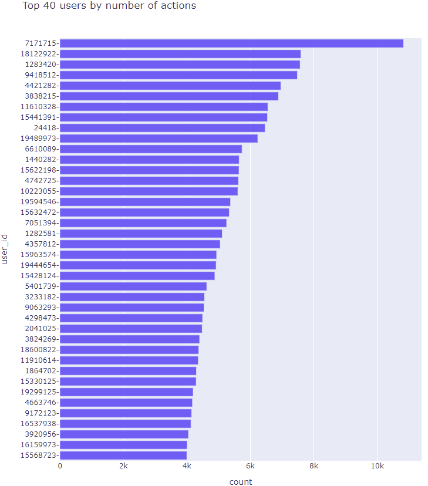
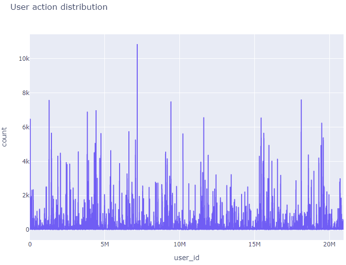
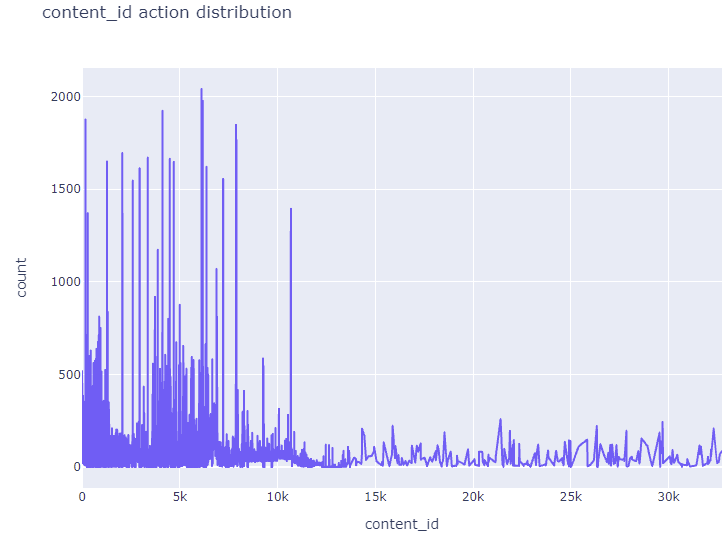
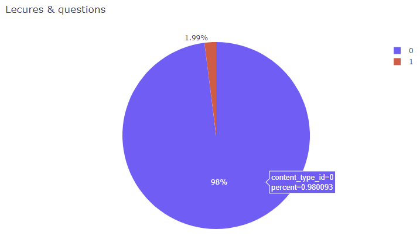
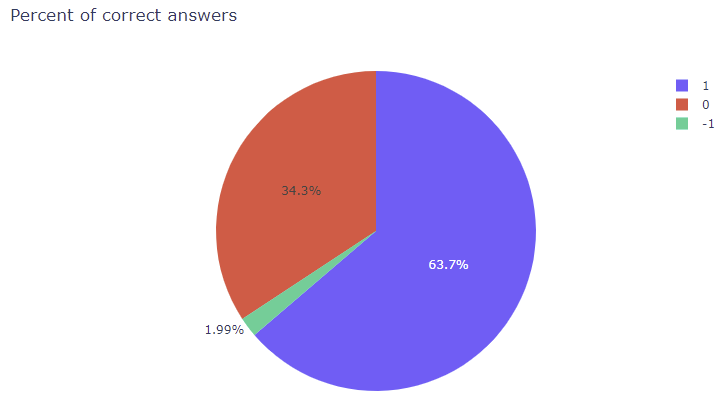
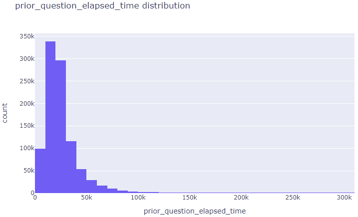

## 数据分析

### train.csv

+ **timestamp**:用户交互与该用户第一次完成事件之间的时间(以毫秒为单位)
+ **content_id**:对应questions.csv中question_id与lectures.csv中的lecture_id
+ **content_type_id**:如果content_type_id为0表示当前交互是用户在答题，若为1表示当前用户在观看lecture
+ **task_container_id**:用户可能会在一行中看到多个问题。 此时多个问题会共享一个task_container_id
+ **user_answer**：用户对问题的回答，如果有的话，对于讲座为-1
+ **answered_correctly**：用户是否回答正确，对于讲座为-1
+ **prior_question_elapsed_time**：用户解决前一个包中的每个问题所花费的平均时间，忽略其间的任何讲座，对于用户的第一个问题集或讲座为空，时间的单位是毫秒
+ **prior_question_had_explanation**：用户在回答前一个问题后是否看到一个解释和正确的回答，忽略中间的任何讲座，对于用户的第一个问题或讲座，该值为null。通常情况下，用户看到的前几个问题是入职诊断测试的一部分，他们没有得到任何反馈。

### questions.csv

+ **bundle_id**:此id相同表示问题在同一个包中
+ **correct_answer**：问题的正确答案
+ **tags**：问题的一个或多个详细标记代码。将不提供标记的含义，但这些代码足以将问题聚集在一起。

### lectures.csv

+ **tag**:lecture的标签，标签的含义将不提供，但这些代码足以将这些讲座聚集在一起。
+ **type_of**:简要说明讲座的核心目的

