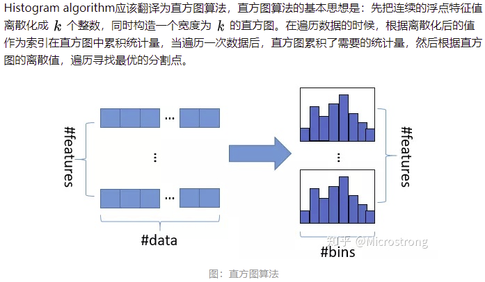
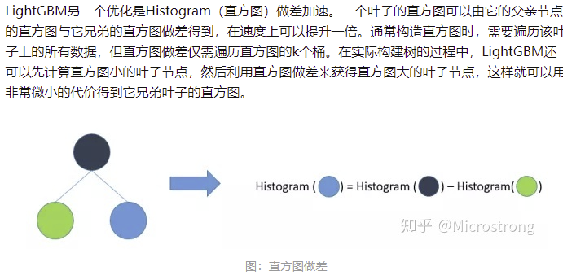
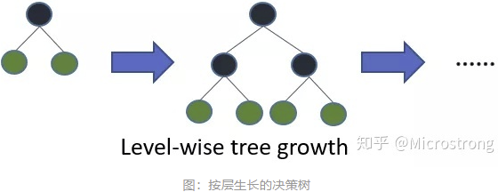
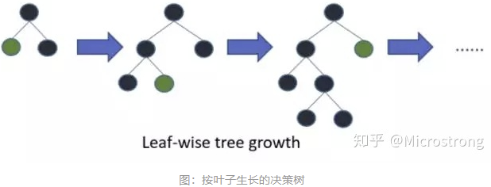

###  **LightGBM简介**

> GBDT (Gradient Boosting Decision Tree) 是机器学习中一个长盛不衰的模型，其主要思想是利用弱分类器（决策树）迭代训练以得到最优模型，该模型具有训练效果好、不易过拟合等优点。而LightGBM（Light Gradient Boosting Machine）是一个实现GBDT算法的框架，支持高效率的并行训练，并且具有更快的训练速度、更低的内存消耗、更好的准确率、支持分布式可以快速处理海量数据等优点。GBDT在每一次迭代的时候，都需要遍历整个训练数据多次。如果把整个训练数据装进内存则会限制训练数据的大小；如果不装进内存，反复地读写训练数据又会消耗非常大的时间。LightGBM提出的主要原因就是为了解决GBDT在海量数据遇到的问题，让GBDT可以更好更快地用于工业实践。

#### 基本原理

+ **基于直方图的决策树算法**

> 优点是内存占用更小，计算代价更小

+ **直方图做差加速**

**XGBoost 在进行预排序时只考虑非零值进行加速，而 LightGBM 也采用类似策略：只用非零特征构建直方图。**

+ **带深度限制的 Leaf-wise 算法**

> 在Histogram算法之上，LightGBM进行进一步的优化。首先它抛弃了大多数GBDT工具使用的按层生长 (level-wise) 的决策树生长策略，而使用了带有深度限制的按叶子生长 (leaf-wise) 算法。XGBoost 采用 Level-wise 的增长策略，该策略遍历一次数据可以同时分裂同一层的叶子，容易进行多线程优化，也好控制模型复杂度，不容易过拟合。但实际上Level-wise是一种低效的算法，因为它不加区分的对待同一层的叶子，实际上很多叶子的分裂增益较低，没必要进行搜索和分裂，因此带来了很多没必要的计算开销。

> LightGBM采用Leaf-wise的增长策略，该策略每次从当前所有叶子中，找到分裂增益最大的一个叶子，然后分裂，如此循环。因此同Level-wise相比，Leaf-wise的优点是：在分裂次数相同的情况下，Leaf-wise可以降低更多的误差，得到更好的精度；Leaf-wise的缺点是：可能会长出比较深的决策树，产生过拟合。因此LightGBM会在Leaf-wise之上增加了一个最大深度的限制，在保证高效率的同时防止过拟合。

### LightGBM优缺点

#### 优点

1. **速度更快**

+ LightGBM 采用了直方图算法将遍历样本转变为遍历直方图，极大的降低了时间复杂度；
+ LightGBM 在训练过程中采用单边梯度算法过滤掉梯度小的样本，减少了大量的计算；
+ LightGBM 采用了基于 Leaf-wise 算法的增长策略构建树，减少了很多不必要的计算量；
+ LightGBM 采用优化后的特征并行、数据并行方法加速计算，当数据量非常大的时候还可以采用投票并行的策略；
+ LightGBM 对缓存也进行了优化，增加了缓存命中率；

2. 内存更小

+ XGBoost使用预排序后需要记录特征值及其对应样本的统计值的索引，而 LightGBM 使用了直方图算法将特征值转变为 bin 值，且不需要记录特征到样本的索引，将空间复杂度从 $ O(2 \times num\_data)$ 降低为$O(num\_bin)$ ，极大的减少了内存消耗；
+ LightGBM 采用了直方图算法将存储特征值转变为存储 bin 值，降低了内存消耗；
+ LightGBM 在训练过程中采用互斥特征捆绑算法减少了特征数量，降低了内存消耗。

#### 缺点

+ 可能会长出比较深的决策树，产生过拟合。因此LightGBM在Leaf-wise之上增加了一个最大深度限制，在保证高效率的同时防止过拟合；
+ Boosting族是迭代算法，每一次迭代都根据上一次迭代的预测结果对样本进行权重调整，所以随着迭代不断进行，误差会越来越小，模型的偏差（bias）会不断降低。由于LightGBM是基于偏差的算法，所以会对噪点较为敏感；
+ 在寻找最优解时，依据的是最优切分变量，没有将最优解是全部特征的综合这一理念考虑进去；

