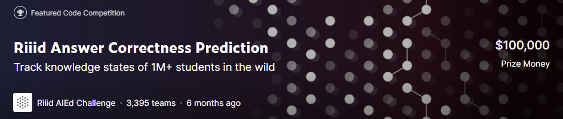
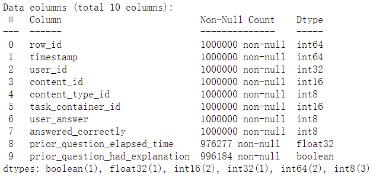
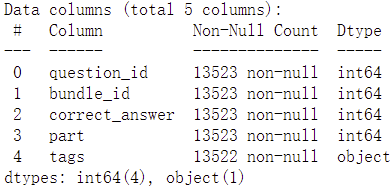
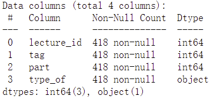

## Riiid AIEd Challenge 2020

> 在这个比赛中，任务是为“知识追踪”创建算法，即随着时间的推移对学生知识进行建模，其目的是准确预测学生在未来互动中的表现。即根据学生历史的答题表现预测学生未来答题表现，也可能出现没有历史表现，预测学生第一次答题的情况（冷启动问题）。

### 数据介绍

+ `train.csv`

+ `questions.csv`

+ `lecture.csv`

更多关于数据的介绍参考这里

### 模型

#### 基于树模型

#### 基于神经网络的模型

